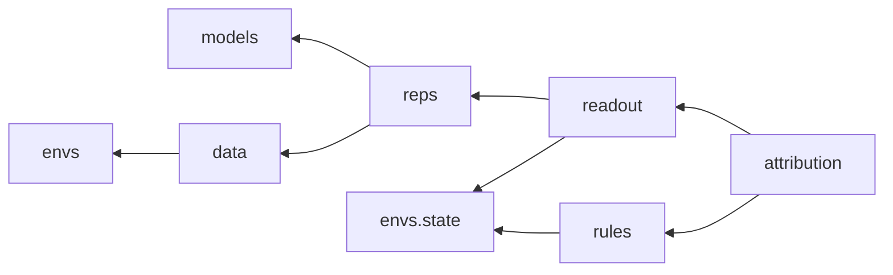

# 程式架構

研究程式碼的結構、模組之間的界線、執行紀錄與測試。目錄結構依循 Python 官方打包指南的 `src` 版面，以及 Scientific Python 社群的開發指南。

## 工具與版本

| 項目 | 選擇 |
| --- | --- |
| Python | 3.11 以上。3.10 於 2026 年 10 月結束支援 |
| 套件與環境管理 | uv；`pyproject.toml` 與 `uv.lock` 都納入版本控制 |
| 固定版本的依賴 | MiniGrid 3.1.0、PyTorch、h5py；升級須通過全部測試 |
| 格式與靜態檢查 | ruff |
| 型別檢查 | mypy，範圍為 `src/` |
| 測試 | pytest；環境性質以 Hypothesis 產生隨機狀態 |
| 模組界線 | import-linter |
| 提交前檢查 | pre-commit |
| 文件檢查 | lychee 檢查連結；另以腳本確認 `docs/decisions/` 中沒有連結 |

若世界模型的起點只能在 Python 3.10 上執行，只在第零階段的重現中使用獨立的 3.10 環境，本專案的程式碼不以 3.10 為目標。

## 目錄

```
concept-rule-attribution/
├── pyproject.toml
├── uv.lock
├── src/cra/
│   ├── envs/          環境、State、反事實分支、可識別性、事件標記
│   ├── data/          行為策略、資料產生、HDF5 讀寫、分割、覆蓋率報告
│   ├── models/        編碼器、信念模組、轉移頭、損失、訓練
│   ├── reps/          凍結模型的表示擷取與快取
│   ├── readout/       讀取器、描述長度、單張畫面上限、介入
│   ├── rules/         特徵、規則語言、搜尋、程式產生、回放
│   ├── attribution/   各種歸因估計、分層、指標、剩餘變化的判定
│   ├── stats/         區間估計、檢定、多重比較
│   └── runs/          執行目錄、中繼資料、種子
├── configs/           各階段與各檢驗的設定檔
├── scripts/           命令列進入點
├── tests/
├── results/           各階段的小型彙總結果，納入版本控制
├── artifacts/         資料集、模型檢查點、執行目錄，不納入版本控制
└── docs/
```

套件名稱為 `cra`。

## 模組之間的界線

依賴方向只能由下游指向上游：



`cra.stats` 與 `cra.runs` 不依賴其他模組，任何模組都可以使用。

以下界線以 import-linter 強制，違反時持續整合失敗：

1. **`cra.models` 不得直接或間接引用 `cra.envs` 與 `cra.data`。** 世界模型只看得到畫面與動作，接觸不到標準答案或環境的內部。訓練迴圈接收一個只產生畫面、動作與回合邊界的可迭代物件，由 `scripts/` 組裝。
2. **`cra.rules` 只能引用 `cra.envs.state`。** 規則搜尋與抽出的函式只能使用共用的 `State` 型別，不得呼叫環境真正的轉移函式，否則抽出的規則可能只是轉呼叫了答案。
3. **`cra.envs` 不引用專案中的任何其他模組。**

另外兩條界線以測試強制：

- 世界模型的訓練資料讀取器只提供畫面、動作與回合邊界。
- 改變第 t 步的動作，不改變 `b_t`。這確保歷史條件表示不含當前動作。

## 共用型別

- **`State`**（`cra.envs.state`）：不可變的資料類別，對應 [environment.md](environment.md) 的狀態變數。提供與陣列互轉的方法，以及回傳（變數，值一，值二）集合的差異函式。標準答案、讀取結果、規則的輸入輸出都使用它。
- **`Action`**：五個動作的列舉，編號依 [environment.md](environment.md)。
- **表示快取**：每個模型檢查點、每個資料分割各一份，包含 `z` 與 `b`（float16）及對應的回合與步驟索引。下游的讀取、規則與歸因只讀快取，不重新執行模型。

## 設定與執行紀錄

設定以 YAML 撰寫，載入為有型別的資料類別。

每次執行在 `artifacts/runs/<階段>/<時間>-<提交前綴>/` 下建立一個目錄，內容包括：

- 解析後的完整設定。
- 中繼資料：提交、工作目錄是否有未提交的修改及其差異、所依據的門檻鎖定標籤、`uv.lock` 的雜湊、Python 與主要套件的版本、所有種子、GPU 型號、驅動與 CUDA 版本、開始與結束時間、最高顯示記憶體用量。
- 訓練紀錄、指標與檢查點。

工作目錄有未提交修改的執行，不得標為確認性。

實驗追蹤只使用本機檔案，不依賴任何外部服務。

## 可重現性

- 所有亂數來源（Python、NumPy、PyTorch、環境）都由設定中的種子決定；每個回合的產生器種子由分割的種子與回合編號推導。
- 測試中開啟 PyTorch 的確定性演算法。訓練時記錄是否開啟；無法確定的運算列在中繼資料中。
- 資料重新產生必須逐位元組相同，這寫成測試。

## 測試

| 類別 | 內容 | 執行位置 |
| --- | --- | --- |
| 環境 | [environment.md](environment.md) 中「環境必須滿足的性質」的全部項目 | 持續整合 |
| 資料 | 寫入後讀回一致；重新產生逐位元組相同；訓練讀取器只提供畫面與動作 | 持續整合 |
| 模型 | 小型設定在 CPU 上訓練數步，損失下降；改變當前動作不改變 `b_t` | 持續整合 |
| 讀取 | 在答案已知的合成資料上讀取；打亂標籤得到隨機猜測 | 持續整合 |
| 規則 | 在真實狀態的小型資料上找回已知規則；產生的模組可以執行 | 持續整合 |
| 統計 | 與已知數值比對 | 持續整合 |
| GPU | 顯示記憶體量測、完整訓練 | 本機 |

## 持續整合

GitHub Actions 在每次推送與合併請求時執行：ruff、mypy、CPU 上的 pytest、import-linter、文件連結檢查、決策紀錄無連結檢查。

## 筆記本

筆記本只用於探索。報告中的任何數字都必須來自 `scripts/` 的執行，並有對應的執行目錄。

## 釋出

- 程式碼以 MIT 授權釋出。
- 資料集與模型檢查點放在外部的典藏服務，附 SHA-256 雜湊值；資料集附資料說明書，模型附模型卡（Mitchell 等，2019）。資料的授權在第一次釋出時決定。
- 版本以語意化版本標記，從第一次釋出起以 Keep a Changelog 的格式維護變更紀錄。
- 每次釋出更新 `CITATION.cff`。
