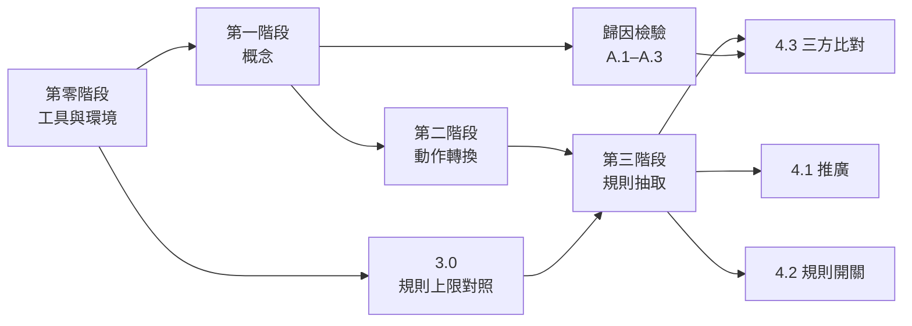

# 評估

各階段的方法與通過條件。統計方法、門檻鎖定與報告格式寫在 [statistics.md](statistics.md)。

## 研究問題與檢驗

| 研究問題 | 檢驗 |
| --- | --- |
| 1. 概念：表示空間是否形成對應真實狀態的概念 | 1.1 至 1.5 |
| 2. 規則：動作是否對應一致的轉換，能否抽出精確規則，是否推廣得更好 | 2.1 至 2.4、3.0 至 3.2、4.1、4.2 |
| 3. 歸因：神經網路估計、規則估計與標準答案是否一致 | A.1 至 A.3、4.3 |

## 相依關係

各項檢驗依實際的相依關係推進，理由記錄在 [decisions/0011](../decisions/0011-stage-dependency-graph.md)。

資源有限時，歸因檢驗優先於第二、三階段。

## 所有檢驗共用的規定

- **先建立基準線。** 每一項檢驗都先以相同架構、未經訓練的模型跑一次。若它也能拿高分，代表這項檢驗衡量的不是它想衡量的東西，必須先修正檢驗本身。
- **相同的讀取方式與測試資料。** 所有比較對象使用相同的讀取器架構與相同的保留資料，否則比較的是實作差異而不是想比較的東西。
- **試驗與確認分開，門檻事先鎖定。** 門檻在試驗量測基準線之後設定，以決策紀錄與 git 標籤鎖定，之後才執行確認性的分析。看到結果後才選出的條件不算數。
- **種子、區間與多重比較**依 [statistics.md](statistics.md)。

## 第零階段：工具與環境

**0.1 世界模型工具。** 重現所選世界模型的一個公開環境結果。通過條件：訓練過程穩定，結果落在原論文回報的種子間範圍內；原論文沒有回報範圍時，落在門檻鎖定紀錄寫定的相對範圍內。同時記錄最高顯示記憶體用量與訓練時間。

另以本專案的設定訓練一次：依 [world-model.md](world-model.md) 修改後的模型、涵蓋整個回合的歷史、本專案的畫面大小。通過條件：最高顯示記憶體用量在 8 GB 以內，且訓練穩定、沒有崩塌。

**0.2 環境驗收。** [environment.md](environment.md) 中「環境必須滿足的性質」全部通過。

**0.3 資料驗收。** [data.md](data.md) 的覆蓋率檢查全部達到最低次數；隱藏與動態目標在原始像素上的讀取結果不超過單張畫面上限，見 [readout.md](readout.md)。

0.2 與 0.3 通過後，即可開始 3.0。0.1 至 0.3 全部通過，才進入第一階段。

## 第一階段：概念是否形成

**方法。** 以 `train` 分割訓練世界模型，凍結後取出 `z_t` 與 `b_t`，依 [readout.md](readout.md) 對每個目標訓練線性讀取器，在 `test` 分割上評分。

| 檢驗 | 目標 | 必須勝過 | 角色 |
| --- | --- | --- | --- |
| 1.1 | 逐格、姿態 | 未經訓練的模型 | 健全性檢查 |
| 1.2 | 相對代理（前方一格、前方第二格） | 未經訓練的模型、原始像素 | 確認性 |
| 1.3 | 自身隱藏（能量、冷卻）、他者隱藏（耐久度） | 未經訓練的模型、單張畫面上限 | 確認性，自身與他者分開判定 |
| 1.4 | 動態（球的行進方向） | 未經訓練的模型、單張畫面上限 | 確認性 |
| 1.5 | 介入檢查 | 長度相同的隨機方向 | 確認性，只對 1.2 至 1.4 中讀取通過的目標進行 |

讀取的主要指標為準確率；描述長度一併回報。介入的指標為介入成功率。

**通過條件。** 逐一目標判斷，依 [statistics.md](statistics.md) 的判定方式。自身與他者的隱藏變數分開回報，不合併成單一分數；只通過其中一個，是可回報的結果，不算檢驗失敗。

**對後續的影響。**

- 1.1 與 1.2 通過，且 `front_type` 的介入檢查通過，才進入第二階段與歸因檢驗。否則代表概念沒有形成，回到試驗調整環境或訓練。
- 1.3 或 1.4 未通過時，不擋住後續檢驗，但第三階段中涉及該變數的規則只能以歷史特徵表達，歸因檢驗中涉及該變數的分層結果加註說明。

## 歸因檢驗：神經網路估計與標準答案

**方法。** 依 [attribution.md](attribution.md)，在 `test` 分割上計算神經網路歸因（純量與結構化）與標準答案，依分層與動作種類計算指標。

| 檢驗 | 內容 | 必須勝過 |
| --- | --- | --- |
| A.1 | M1 偵測：在「前進」的步驟中區分有無效果；在「作用」的步驟中區分有無效果 | 未經訓練的模型、觀測變化量 |
| A.2 | M3 結構與 M4 間接：結構化估計的逐變數 F1，以及預防、促成事件的召回率 | 未經訓練的模型 |
| A.3 | M5 延遲：k 步估計在延遲效果分層上的 M1 | 未經訓練的模型 |

A.1 的兩個比較與 A.2 中預防事件的召回率為確認性，其餘為次要指標。[world-model.md](world-model.md) 的診斷一併回報。

**通過條件。** 確認性比較依 [statistics.md](statistics.md) 判定。未通過時，三方比對中只比較規則估計與標準答案。

## 第二階段：動作是否對應一致的轉換

**方法。** 對每種動作，收集它在各種不同情境下造成的單張畫面表示變化 `z_{t+1} − z_t`，依序檢查：

- **2.1** 這些變化在不同情境下是否接近同一個方向：同一動作內的平均餘弦相似度，與不同動作之間的比較。
- **2.2** 若不是，能否以一個線性轉換描述：在 `train` 上擬合，在 `test` 上量測解釋的變異比例，並與轉移頭比較。
- **2.3** 對條件式規則，變化是否分成幾個區域，每個區域內各自是線性的：依標準答案中的條件（例如推動成功、後方被擋、沒有能量、冷卻中）分組，分別擬合。
- **2.4** 介入檢查：沿著某動作的平均變化方向推動表示，檢查讀出的狀態是否符合該動作的規則。

所有量都與未經訓練的模型比較。

**結論形式。** 這個階段不以通過或失敗判定，而是得出三種結論之一：規則對應單一方向、規則對應依情境切換的轉換，或規則在表示空間中完全是非線性的。結論寫進第三階段的門檻鎖定紀錄，作為選擇搜尋方法與特徵的依據之一。

## 第三階段：能否抽出精確規則

**3.0 上限對照。** 依 [rule-extraction.md](rule-extraction.md)，在真實狀態上比較候選搜尋方法並選定一種。通過條件：選定的方法在保留資料的真實狀態上，找回 [environment.md](environment.md) 規則表中的每一條規則。未通過代表搜尋方法本身不足，先更換方法，不進入 3.1。

**3.1 從表示抽取。** 以讀出的狀態搜尋，以真實狀態判定。確認性指標：

- 規則表中被正確找回的規則比例。
- 保留資料上，函式套用到真實狀態時，下一步 `State` 完全正確的比例。

**3.2 端到端。** 同一個函式套用到讀出的狀態時，下一步 `State` 完全正確的比例，以及它與 3.1 的差距。

**通過條件。** 3.1 的兩項指標達到門檻。未通過時，依與上限對照的差距判斷失敗出在表示空間還是搜尋方法，這本身就是可回報的結果。

## 第四階段

三項檢驗，各自獨立判定。

### 4.1 分級推廣測試

**方法。** 以 [comparisons.md](comparisons.md) 中的各組設定，預測每一級推廣資料的下一步 `State`，與真實的下一步比較。

| 方向 | 第一級 | 第二級 |
| --- | --- | --- |
| 外觀 | 箱子為紫色 | 箱子為藍色、球為黃色 |
| 數量 | 箱子 4 個 | 箱子 5 個、球 3 顆 |
| 布局 | 一段長 3 格的內部牆面 | 兩段內部牆面形成走廊 |

第零級為 `test` 分割。畫面大小在所有級別中固定，理由記錄在 [decisions/0013](../decisions/0013-generalization-axes-and-capacity-controls.md)。外觀方向中，顏色本身的讀取在設計上必然失敗，因此這個方向的指標不包含顏色。

另依每種條件組合在訓練資料中出現的次數分層，檢查表現是否隨出現次數下降。

使用分級系列而非單一測試，是因為單一的通過或失敗無法區分「從未學到規則」與「學到了，但表示在陌生畫面上崩壞」，分級曲線能指出能力在哪裡開始失效。規則套用到真實狀態的上限設定，以及每一級的讀取準確率，用來分辨失敗出在讀取還是規則。

**指標。** 每一級的下一步 `State` 完全正確的比例；保留比例為第一、二級的平均除以第零級。

**通過條件。** 抽出的規則，或規則與神經網路的結合，其保留比例高於神經網路預測器，且高於同閘控的雙網路與加倍參數的單一網路。

### 4.2 規則開關的成對比較

**方法。** 在時間規則開與關的兩套資料上，分別完成第一到第三階段。

**通過條件。** 兩項都必須成立：

- 抽出的函式在兩個條件之間的差別，恰好是冷卻相關的規則，其餘完全相同。以達到這一點的種子比例判定。
- 在「成功推動後的冷卻步數內，再次向前推箱子」的步驟中，神經網路歸因在兩個條件之間的差異，大於同一條件下不同種子之間的差異。這些步驟在時間規則開啟時沒有效果，關閉時有。

單一條件無法支撐「發現了這條規則」的主張，因為行為或規則的改變可能出自不相關的原因，只有成對比較能把它們分開。

### 4.3 三方歸因比對

**方法。** 依 [attribution.md](attribution.md)，在保留資料上比較神經網路估計、規則估計與標準答案，包含預防事件與延遲效果；並評估規則解釋不了的變化的判定，有特權與沒有特權兩種版本分開。

**通過條件。** 結構化的神經網路估計與規則估計，相對於標準答案的逐變數 F1 都高於未經訓練的模型。兩者彼此不一致的步驟，逐一記錄是哪一方偏離標準答案。歸因檢驗未通過時，只判定規則估計。

## 停止規則

一項檢驗未通過，只擋住依賴它的檢驗。任何未通過的檢驗，都不以擴大規模或改用更複雜環境的方式繞過。這條規定是為了避免負面結果被解讀成「需要更大的規模」。

4.3 通過後，才把機制移到有多個變化來源的更複雜環境；未通過，則先重新檢討機制本身。
