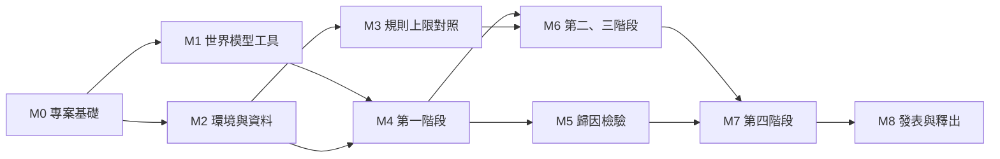

# 路線圖

把 [evaluation.md](../design/evaluation.md) 的各項檢驗拆成可執行的里程碑：每個里程碑的工作、產出、進入條件與完成條件。檢驗本身的方法與通過條件以規格為準，本文件只安排工作。

進度改變時直接更新本文件。

## 目前狀態

2026-10-02：設計文件完成，尚未撰寫任何程式碼。下一個里程碑為 M0。

| 里程碑 | 狀態 |
| --- | --- |
| M0 專案基礎 | 未開始 |
| M1 世界模型工具 | 未開始 |
| M2 環境與資料 | 未開始 |
| M3 規則上限對照 | 未開始 |
| M4 第一階段 | 未開始 |
| M5 歸因檢驗 | 未開始 |
| M6 第二、三階段 | 未開始 |
| M7 第四階段 | 未開始 |
| M8 發表與釋出 | 未開始 |

## 相依關係

M1 與 M2 可以並行；M3 可以與 M4 並行。資源有限時，M5 優先於 M6。

## M0 專案基礎

**工作。**

- 依 [architecture.md](../design/architecture.md) 建立 `pyproject.toml`、`uv.lock` 與 `src/cra/` 的骨架。
- 設定 ruff、mypy、pytest、import-linter、pre-commit。
- 建立 GitHub Actions：靜態檢查、測試、模組界線、文件連結檢查、決策紀錄無連結檢查。

**完成條件。** 持續整合在空骨架與現有文件上通過。

## M1 世界模型工具（第零階段 0.1 的前半）

**進入條件。** M0 完成。

**工作。**

- 在目標 GPU 上安裝 LeWorldModel，必要時使用獨立的 Python 3.10 環境。
- 選一個公開環境重現，以資料量與訓練時間最小者優先。記錄最高顯示記憶體用量與訓練時間。
- 確認能否在 Python 3.11 以上執行，或哪些模組需要移植。
- 依 [world-model.md](../design/world-model.md) 實作修改：信念模組與轉移頭分開，位置編碼長度可設為回合長度。在 CPU 上以小型設定通過「改變當前動作不改變 `b_t`」的測試。

**產出。** 決定 [decisions/0003](../decisions/0003-lewm-as-world-model-starting-point.md) 接受或另立替代的紀錄。

**完成條件。** 0.1 的重現部分通過。以本專案設定訓練的部分需要 M2 的資料，併入 M4 的試驗。

## M2 環境與資料（第零階段 0.2、0.3）

**進入條件。** M0 完成。

**工作。**

- 實作 `PushRoomEnv`、`State`、事件標記、可識別性與記憶年齡、反事實分支，依 [environment.md](../design/environment.md)。
- 把「環境必須滿足的性質」全部寫成測試。
- 實作資料產生器、HDF5 讀寫、分割與清單，依 [data.md](../design/data.md)。
- 以 `pilot` 分割產生覆蓋率報告，調整環境參數；計算單張畫面上限與像素上的洩漏檢查。
- 寫第零階段的門檻鎖定紀錄（覆蓋率最低次數、確定的環境參數），建立標籤 `prereg/stage-0`。
- 產生時間規則開與關兩套正式資料；撰寫資料說明書的初稿。

**完成條件。** 0.2 與 0.3 通過。

## M3 規則上限對照（3.0）

**進入條件。** M2 完成。

**工作。** 依 [rule-extraction.md](../design/rule-extraction.md) 實作特徵、規則語言、候選搜尋方法、程式產生與回放；在真實狀態上比較候選方法並選定一種。

**完成條件。** 3.0 通過：選定的方法在保留資料的真實狀態上找回規則表中的每一條規則。

## M4 第一階段

**進入條件。** M1、M2 完成。

**工作。**

- 試驗：以兩組試驗種子、本專案設定訓練世界模型，同時完成 0.1 的後半（顯示記憶體在 8 GB 以內、訓練穩定）。以 25%、50%、100% 的訓練資料確認資料規模。
- 實作表示快取、讀取器、描述長度、介入檢查，依 [readout.md](../design/readout.md)。
- 以試驗結果量測基準線，寫第一階段的門檻鎖定紀錄，建立標籤 `prereg/stage-1`。
- 確認：至少五組種子，時間規則開與關各一套。
- 撰寫第一階段報告。

**完成條件。** 第一階段報告完成，1.1、1.2 與 `front_type` 的介入檢查通過與否已判定。

## M5 歸因檢驗

**進入條件。** M4 的 1.1、1.2 與 `front_type` 介入檢查通過。

**工作。** 依 [attribution.md](../design/attribution.md) 實作神經網路歸因、基準、分層與指標；試驗；門檻鎖定與標籤 `prereg/attribution`；確認；報告。

**完成條件。** 歸因檢驗報告完成。

## M6 第二、三階段

**進入條件。** M4 的 1.1、1.2 通過；M3 完成。

**工作。** 第二階段的四項分析與結論；從讀出的狀態抽取規則；第三階段的門檻鎖定與標籤 `prereg/stage-3`；確認；兩份報告。

**完成條件。** 第三階段報告完成。

## M7 第四階段

**進入條件。** M6 的 3.1 通過；4.3 另需 M5 完成。

**工作。** 產生推廣測試資料；訓練設定 4a、4b、5；完成規則開關的成對比較與三方比對，包括剩餘變化的兩種判定；門檻鎖定與標籤 `prereg/stage-4`；確認；報告。

**完成條件。** 第四階段報告完成。

## M8 發表與釋出

**工作。**

- 撰寫技術報告或論文。
- 釋出程式碼 1.0.0、資料集與模型檢查點，附資料說明書與模型卡；更新 `CITATION.cff`，開始維護變更紀錄。
- 對外徵求貢獻之前，加入行為準則。
- 依 [decisions/0002](../decisions/0002-minigrid-as-environment.md) 規劃在 Crafter 上的後續檢驗。

## 計算量估計

以下為估計，M1 量得單次訓練的時間後更新。

確認性的世界模型訓練次數：第一階段 5 種子 × 時間規則開關 2 套 = 10 次；第四階段設定 4b 與 5 各 5 次 = 10 次；各階段試驗約 4 至 6 次。合計約 25 次。設定 4a 的第二個網路使用另一個種子已訓練好的模型，不另外訓練。

若單次訓練在目標 GPU 上需要 4 到 12 小時，總計約 100 到 300 GPU 小時，不含讀取、規則搜尋與資料產生，這些主要在 CPU 上執行。
